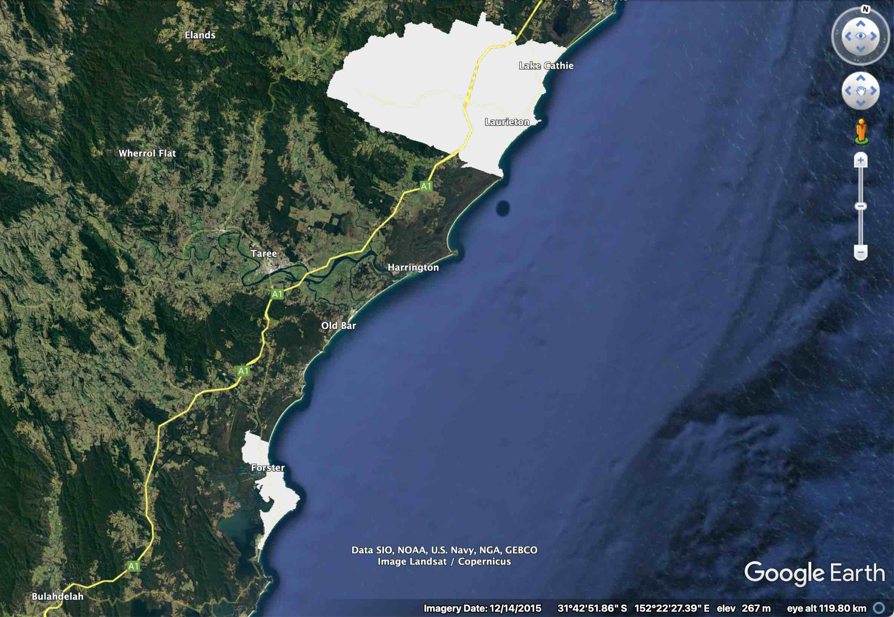
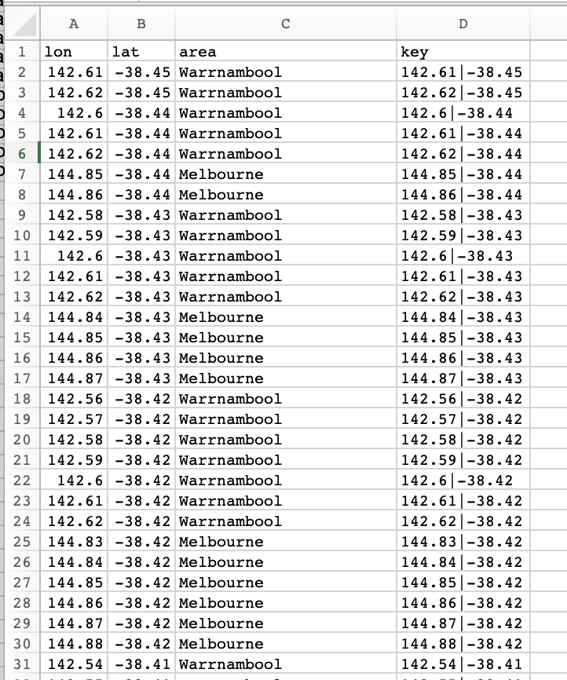
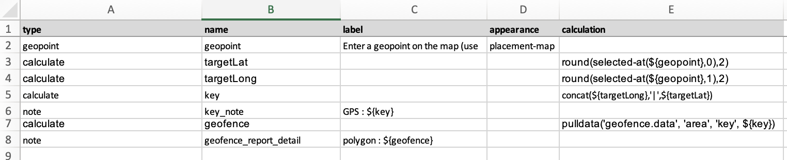
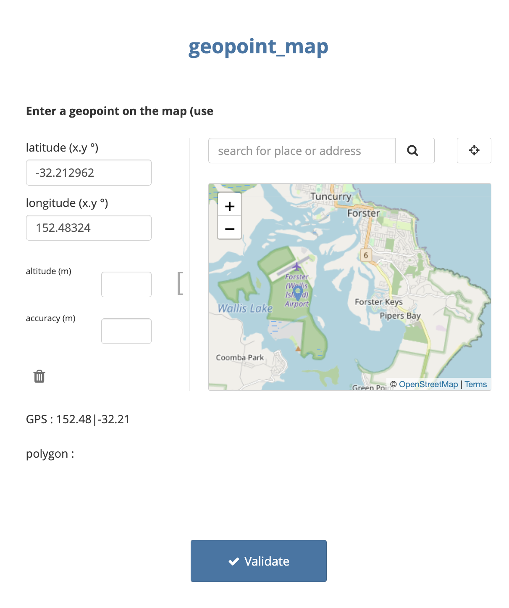
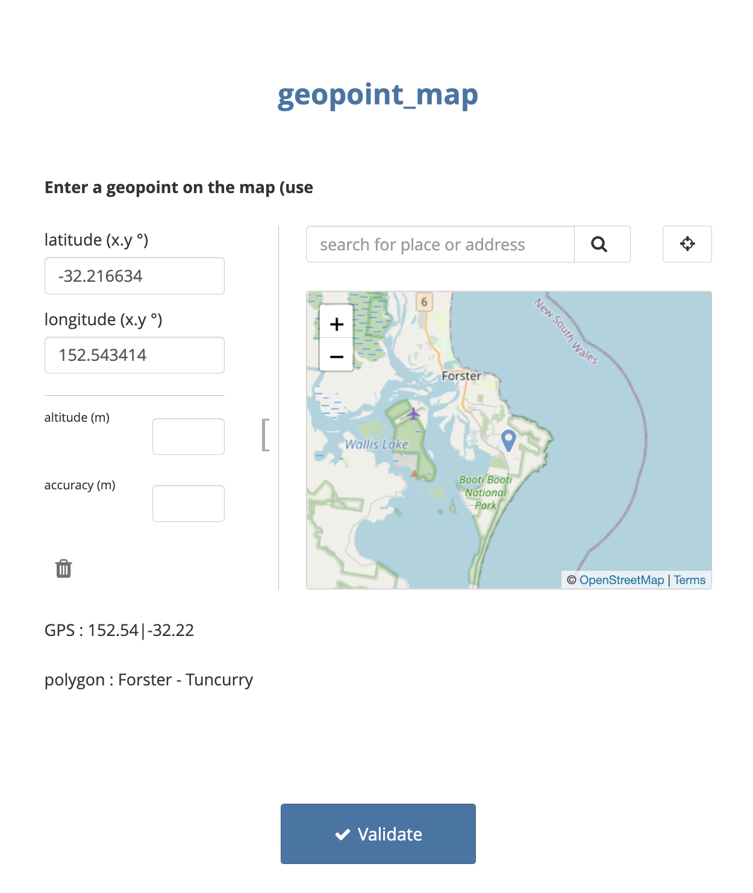
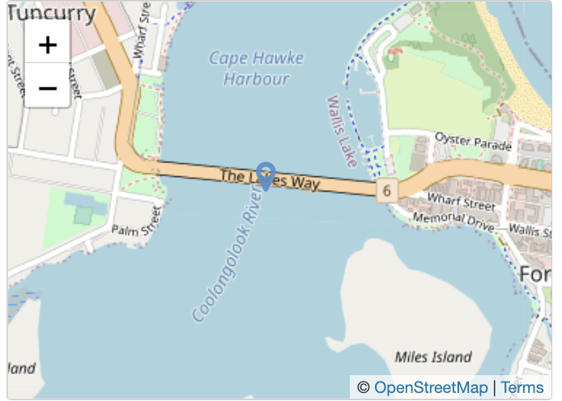
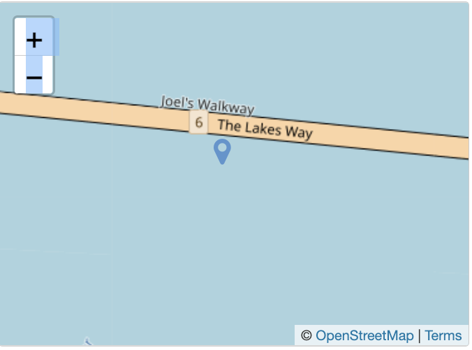

# ODK Geofencing

This repo provides methods for [geofencing](https://en.wikipedia.org/wiki/Geo-fence) GPS data in ODK, KoBoToolbox, Ona, Survey CTO &amp; CommCare. To reproduce the work, you'll need some limited knowledge of how to use [R](https://www.r-project.org/) and of how to design and use [XLSforms](xlsform.org). 

Geofencing is a process where geographical features, traces or shape-files are used as boundaries against which other geographical data are compared or tested. The image below gives a basic idea. The grey spaces are two polygons representing the limits of defined urban ares of New South Wales, Australia. Specifically they delimit the boundaries of the 45 km^2 Forster - Tuncurry and the 525 km^2 Camden Haven area. 

In practical terms, a user might provide software with a set of 'shape files', geographical polygons; then to identify (a) whether a newly collected GPS datum falls within any of these polygons and (b) if so, to identify which ones. 



In this example, we will provide our software (ODK etc.) with a gps point and it will tell us which polygon (if any) the point exists within. 

A good example of how a geofence can be used is within a clinical trial, where potential participants may only be eligible to take part if they live inside specified geographical limits, which can be described by multi-polygon shape files.

In a previous [showcase on the ODK forum](https://forum.getodk.org/t/odk-geofence-v1/18656), @Xiphware provided a neat solution for geofencing in ODK and proposed that a future improvement to that method may require some kind of decomposition of polygons. 

The approach described in this post is conceptually based on that principle, i.e. that at any resolution (i.e. 0.1 degrees, 0.01 degrees) all geospatial locations on Earth can be decomposed to a matrix of n^2 individual points, where n is 360/resolution. To test a gps position against the decomposed matrix, it becomes a simple process to round a gps location to the same resolution as the grid and then to perform a lookup on an external list that contains the matrix. 

Because of the nature of decomposition, a higher resolution (i.e. smaller distances between points in the matrix) means more precise geofencing, but becomes unweildy as the geographical range (village, town, district, country, continent, globe) increases

The table demonstrates the relationship between resolution, distance and number of points in the matrix; assuming a global map. 

|resolution  | resolution (at equator) |n    |n^2 [globally] |  
| ---------- | ---------| --- | --- |  
| 1.0 degree | 111 km   |360  | 0.13 million|
| 0.1 degree | 11.1 km  |3600 | 13 million|
| 0.01 degree| 1.1 km   |36000 | 130 million |  


For practical purposes the matrix should be (1) as high resolution as possible and (2) geographically limited to the regions of interest. 

## Example : Part 1 - Creating the geofence

In practice it wouldn't make a lot of sense to make a grid for the whole of the Earth at very high resolution, as you're likely to be working on a more controlled area and the data set would get very big. So let's take Australia as an example. You'll find Australia within the bounds of latitude -42.0 to -10,0.01 and longitude 110 to 155.0, so the matrix need only extend to these coordinates. 

At 0.01 (1.1km) resolution, a decomposed grid of points covering the whole of Australia is about 12 million points. 

This is the start point for an example where we extract points that fall within a multi-polygon shape file and feed these in to ODK as the basis of a geofence. The shape files used here come from the Significant Urban Areas, Urban Centres and Localities of Australia. These are a bunch of open source shapefiles that draw polygons around major urban areas in Australia. These data are provided by the Australian Bureau of Statistics. They can be accessed [here](https://www.abs.gov.au/AUSSTATS/abs@.nsf/DetailsPage/1270.0.55.004July%202016?OpenDocument).

The first steps are done in R and use the libraries `tidyverse` and `sf`.


* Read the polygon shapefile and remove any problematic polygons [here there are some that aren't in any significant urban area]

```
map = read_sf("SUA_2016_AUST.shp/SUA_2016_AUST.shp")  
map <- filter(map,str_detect(map$SUA_NAME16,"Not in any Significant Urban Area")==FALSE)
```

* Now create a grid of all global points at 0.1 degree resolution. The `expand_grid` command is useful for making a matrix this way.

```
global.0.1 <- expand_grid(lat = seq(-40.0,-10,0.01), lon = seq(110,150.0,0.01))
```
* Convert the points of the matrix to coordinates compatible with sf objects

```
pnts_sf <- st_as_sf(global.0.1, coords = c('lon', 'lat'), crs = st_crs(map))
```

* Find the intersections of the decomposed matrix points and the template polygons
  * This can take a while. In our tests, 12 million points took about 10 minutes to compute
  
```
pnts.intersection <- pnts_sf %>% mutate(
  intersection = as.integer(st_intersects(geometry, map))
  , area = if_else(is.na(intersection), '', map$SUA_NAME16[intersection])
)
```

* filter the resulting table to include only data points that are inside polygons
 * Tidy this up so that lat and lon are in different fields, and provide the name of the area in the third column

```
inside.polygons<-tibble(filter(pnts.intersection,area!="")) %>%
  mutate(
    geometry = as.character(geometry),
    geometry=str_sub(string = geometry,start = 3,end = str_length(geometry)-1),

    area = as.factor(area)
  ) %>%
  separate(geometry, c("lon", "lat"), ", ") %>%
  mutate(
    lon=format(round(as.numeric(lon), digits=2)) ,
    lat=format(round(as.numeric(lat), digits=2)) ,
    key = str_c(lon,lat,sep = "|")) %>%
  select(-intersection)

```

* Finally, export the list to a csv file, which we will use in ODK

```
write_csv(inside.polygons,"geofence.data.csv")
```

## Geofence in decomposed CSV format

The CSV file we just created for Australia at 0.01 degree resolution had 46,000 points that fell within polygons. The table below is a sample of lines




## Example : Part 2 - Creating an XLS Form that uses the geofence
 
The XLSForm is very simple. It consists of 

* A geopoint question, which captures the point that will be tested against the polygons. Here it is a `placement-map` type, but this works with GPS collected data too.
* A pair of calculations, which extract the first (Latitude) and second (Longitude) data points from the geopoint. These are rounded to the same resolution as the polygon data (here 2 decimal places, 0.01 degrees)
* Another calculation, which concatenates the resolution-matched geopoint data in the same format found in the geofence data set
* A note, which displays the resolution-matched geopoint 
* A further calculation, which grabs exactly zero or one line of matching data from the geofence data set, which is sideloaded as a csv file
* A note, which displays the name of the matching polygon



## Example : Part 3 - In action

This image shows a negative result, with the geopoint just outside the limits of the Forster - Tuncurry area



Whilst this one shows a positive result, with the geopoint well inside the limits of Forster - Tuncurry area



## Performance

This works fast with 46000 lines (CSV was 1.6 MB) in the geopoint data. We recommend never feeding this a massive data set, but to reduce the geographical scale as you increase the resolution. Remember that XLSForms store GPS data at 6 decimal places, but you aren't going to get this system to work at that level!

To give an example of why not, look at this. Forster - Tuncurry is about 45 km^2. Not a huge area. 
But as resolution goes up, so the number of points in the matrix expands hugely

|resolution degrees  | GPS decimal places | resolution (at equator) | points in matrix|  
| ------------------ | ------------------ | ------------------------| --------------- |  
| 0.01 | 3 |1.1 km   | 273 |  
| 0.001 | 4| 100 m   | 24,926 |  
| 0.0001 | 5| 10 m   | 2,463,251 |  
| 0.00001 | 6| 1 m   | 246,020,500 |  

Remembering that the best resolution the average GPS receiver on a phone will get is about 10 m, we benchmarked performance with 10 metre resolution or 4 decimal places. Conveniently this is also the resolution of the maps that provide the shapefiles.

The CSV file is now ~26 MB. Pretty big

The form loads on Enketo in about 8 seconds.

The resolution is also great

Look at the boundary of the polygon for Forster - Tuncurry. North of the bridge is inside. South is outside.


If we place a marker in ODK on the bridge, it detects the point as being inside the polygon



But about 10 m south, it detects the point as being outside the polygon



On ODK Collect, the first time you use this form it will pre-load the data from the CSV, which took about 20 seconds. On subsequent uses, it takes no time at all!


